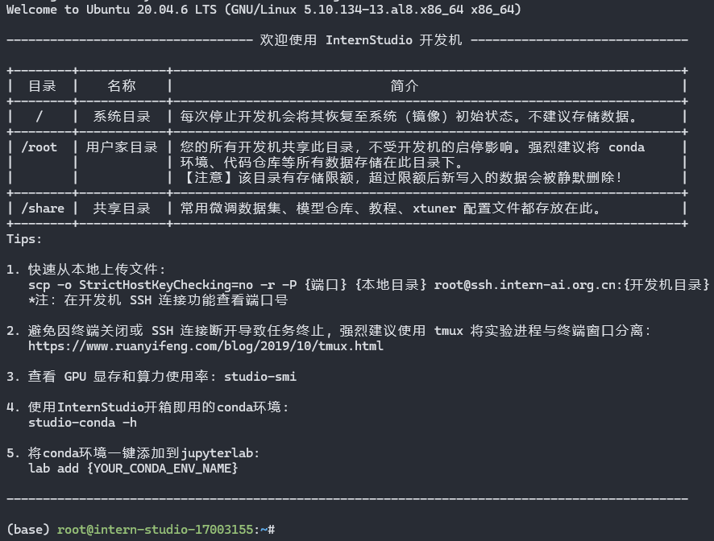
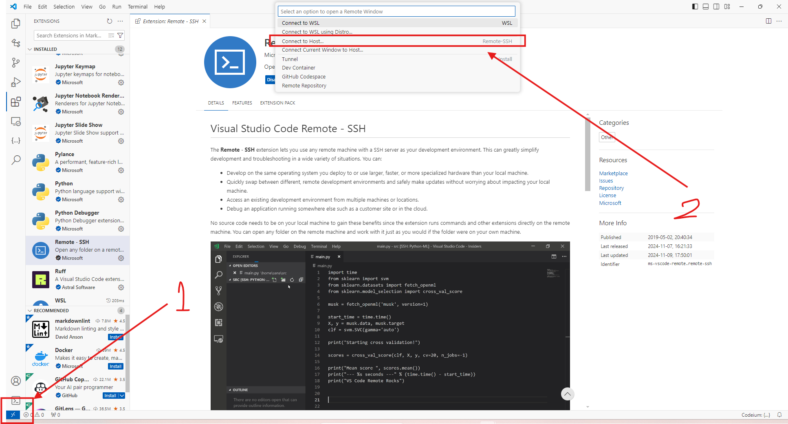
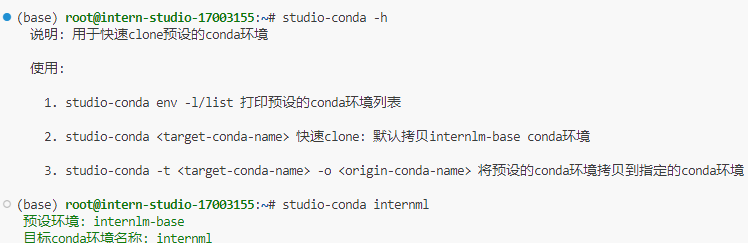

# 1.1 Linux 前置基础
## 任务1：完成SSH连接与端口映射并运行hello_world.py
### 1. 新建一个SSH key
本地主机系统：Arch Linux

命令行输入命令：
```
ssh-keygen -t ed25519 -C <my@email.com>
```
然后一路回车，生产一个新的SSH Key。然后命令行输入：
```
cat ~/.ssh/id_ed25519.pub
```
复制Public Key
> Tips: 这里一定主要要加上`.pub`，不然会显示Private Key，泄露有风险。

### 2. 上传SSH Key到开发平台
- 登录Intern Studio
- 选择`配置SSH Key`=>`添加SSH公钥`=>填写一个名称=>粘贴刚才复制的Public Key=>`立即添加`

### 3. SSH连接
#### 3.1 创建开开发机
- 资源： 10%A100，目前唯一可选
- 镜像：Cuda12.2-conda
创建后启动开发机，SSH连接从灰色变成可用，复制登录命令
```
ssh -p 40513 root@ssh.intern-ai.org.cn -o StrictHostKeyChecking=no -o UserKnownHostsFile=/dev/null
```
回到Arch命令行，粘贴上面的命令并执行，voilà！

> Tips: 两次`Ctrl+D`可以退出SSH登录，退出后所有session不会保留，如果想保留session会话，可以使用Tmux之类软件

> Tips: 在Arch主机创建/编辑文件`~/.ssh/config`，添加以下内容，就可以直接通过`ssh internlm`连接到开发机。
```
Host internlm
  Hostname ssh.intern-ai.org.cn
  IdentityFile ~/.ssh/id_ed25519
  User root
  Port 40513
  StrictHostKeyChecking no
  UserKnownHostsFile /dev/null
```

## 任务2：将Linux基础命令在开发机上完成一遍
```
rm -rf /*
```

## 任务3：使用 VSCODE 远程连接开发机并创建一个conda环境
### 3.1 VSCODE远程连接
- 安装`VS Code`
- 安装`Remote SSH`插件
    - 点击`VS Code`左下角的蓝色小药丸
    - 上面弹出 选择`Connect to Host`
    
    - 之前设置了`~/.ssh/config`，直接选择`internlm`
    - 第一次登陆时可能要求选择开发机系统类型，选择`Linux`就可以了

### 3.2 创建conda环境
通过`VS Code`连接开发机后，打开Terminal，
```
studio-conda -h
```
查看帮助，
```
studio-conda internlm
```
创建（克隆Base环境）一个名为`internlm`的新环境


耐心等待完成。
> Tips: 等了一个世纪都没创建完成，不等了，估计以后也不用，就用Base通关。
或者原生 `conda create -n internlm`来创建
