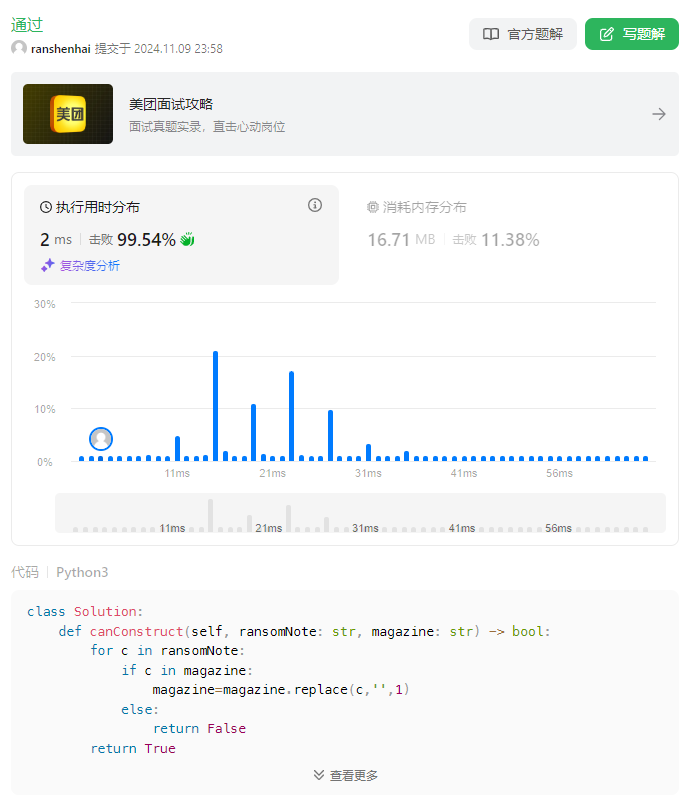
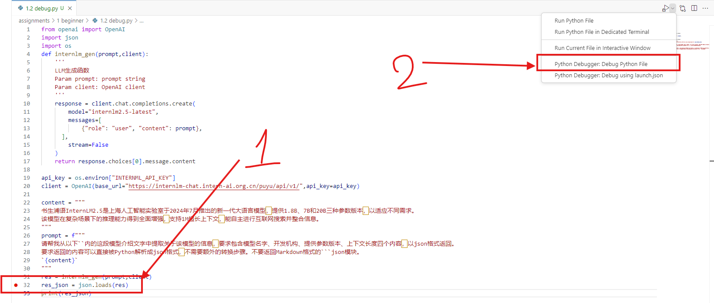
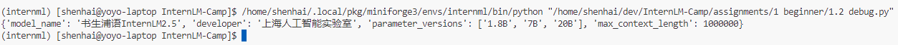
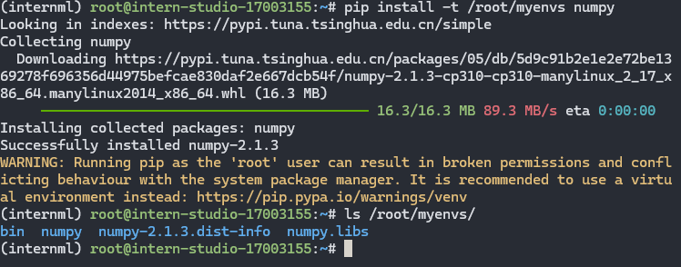

# 1.2 Python前置基础

## 1. LeetCode 383


## 2. 结构化JSON
### 2.1 Debug
1. 在32行设置断点
2. 通过`VS Code`调试本文件
 
发现错误的原因是InternLM2.5生成的结果包括Markdown代码块的前后文本，删除即可。

### 2.1 修复代码
可以通过在32行前添加以下代码实现
```python
res = res.replace('```','').replace('json','',1)
```

全代码文本如下
```python
from openai import OpenAI
import json
import os
def internlm_gen(prompt,client):
    '''
    LLM生成函数
    Param prompt: prompt string
    Param client: OpenAI client 
    '''
    response = client.chat.completions.create(
        model="internlm2.5-latest",
        messages=[
            {"role": "user", "content": prompt},
      ],
        stream=False
    )
    return response.choices[0].message.content

api_key = os.environ["INTERNML_API_KEY"]
client = OpenAI(base_url="https://internlm-chat.intern-ai.org.cn/puyu/api/v1/",api_key=api_key)

content = """
书生浦语InternLM2.5是上海人工智能实验室于2024年7月推出的新一代大语言模型，提供1.8B、7B和20B三种参数版本，以适应不同需求。
该模型在复杂场景下的推理能力得到全面增强，支持1M超长上下文，能自主进行互联网搜索并整合信息。
"""
prompt = f"""
请帮我从以下``内的这段模型介绍文字中提取关于该模型的信息，要求包含模型名字、开发机构、提供参数版本、上下文长度四个内容，以json格式返回。
要求返回的内容可以直接被Python解析成json格式，不需要额外的转换步骤。不要返回Markdown格式的```json模块。
`{content}`
"""
res = internlm_gen(prompt,client)
res = res.replace('```','').replace('json','',1)
res_json = json.loads(res)
print(res_json)
```

运行结果如下：


> 思考：能不能通过Prompt调优解决，直接生成Python可以解析的JSON呢？

## 3. pip安装
`pip install -- help`发现 `-t` 含义如下
```
 -t, --target <dir>          Install packages into <dir>. By default this will not replace existing files/folders in <dir>. Use --upgrade to replace existing packages in <dir> with new versions.
```
登录开发机，在命令行输入：
```
pip install -t /root/myenvs numpy
```
完成如下



