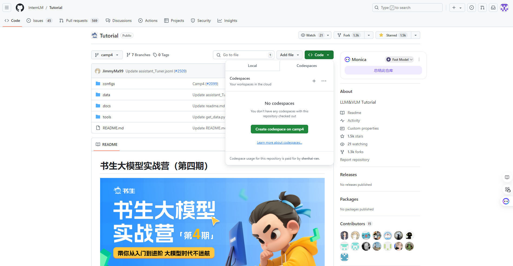
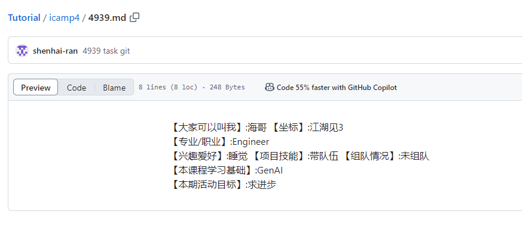

# 1.3 Git前置基础
## 1. 破冰活动：自我介绍
> Tips: 不想clone到本地的，可以直接fork官方Tutorial，然后使用Github的codespace编辑

- 自我介绍

- 创建PR [link](https://github.com/InternLM/Tutorial/pull/2512)

## 2. 实践项目：构建个人项目
先用这个作业仓库提交，想想有啥好项目可以做出起来。

[本仓库地址](https://github.com/shenhai-ran/InternLM-Camp)