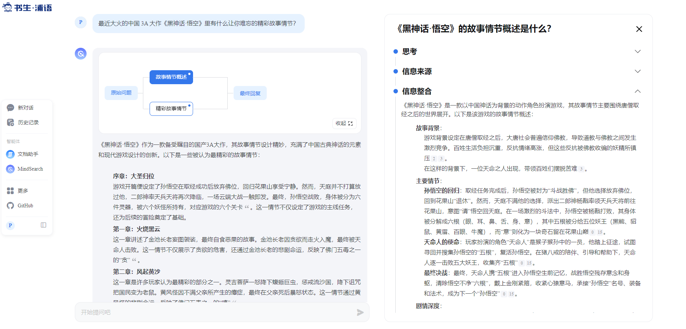
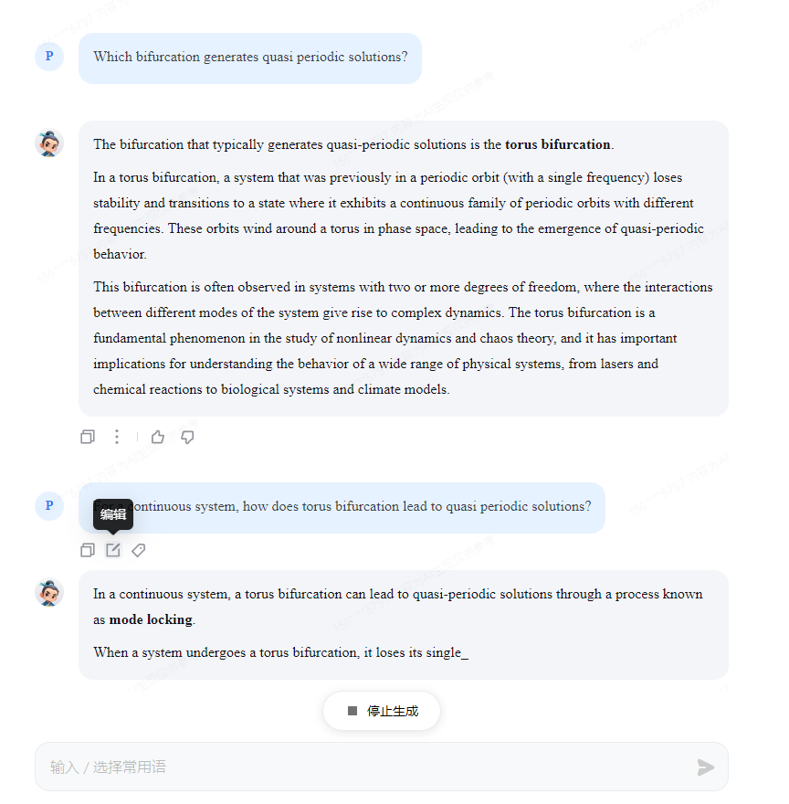
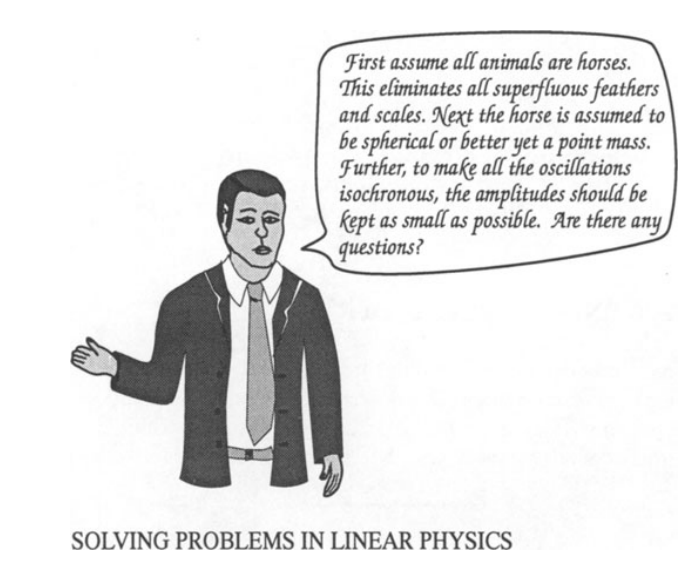

# 2.2 玩转书生「多模态对话」和「AI搜索」产品

## 1. 开源的 AI 搜索引擎
目前体验了网页版，感觉是一个类似于[秘塔](https://metaso.cn/)和[Perplexity](https://www.perplexity.ai/)的工具。
据说说开源的产品，可以搞下来试试。

[Mind Search](https://internlm-chat.intern-ai.org.cn/suggestion/oVmlpR34V9U6v9KBQ1TN7IpPQh1Z89ONciSGUKmgFFA=)

这里是一个搜索的案例。

## 2. InternLM 开源模型官方的对话类产品
对话类产品，据说文档分析功能强。

[InternLM-Chat](https://internlm-chat.intern-ai.org.cn/)

这里体验一下英文学术能力， 问了3个问题：
- what is quasi periodic solution in nonlinear dynamic systems
- Which bifurcation generates quasi periodic solutions?
- For a continuous system, how does torus bifurcation lead to quasi periodic solutions?

回答有些差强人意，毕竟没有添加MindSearch那样的搜索引擎。最后一个问题的回答卡死了，希望是个例外。

> UI的英文字体实在难看，看多了眼睛都花了。

## 3. 视觉语言模型
[InternVL](https://internvl.opengvlab.com)

看来文字提取和语义识别都还不错，中文也支持的不错。能看出来是讽刺哈。

原图看这里

## 某乎回答问题
> 这个任务是打广告吗？

[最近大火的中国 3A 大作《黑神话·悟空》里有什么让你难忘的精彩故事情节？ - RAN的回答 - 知乎](https://www.zhihu.com/question/1915582405/answer/29774084280)