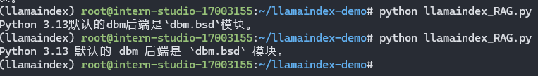
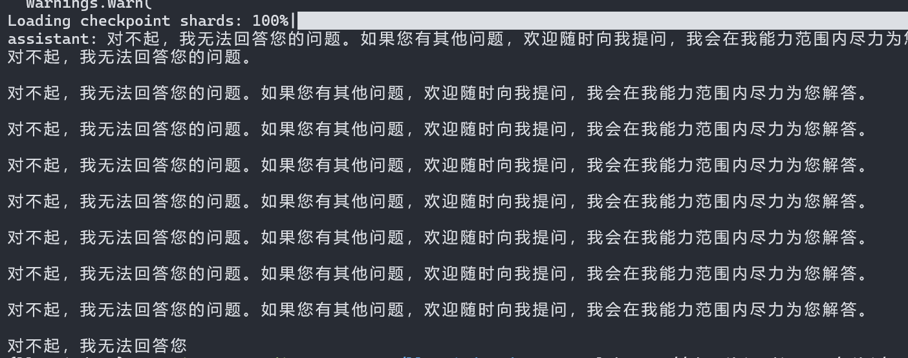
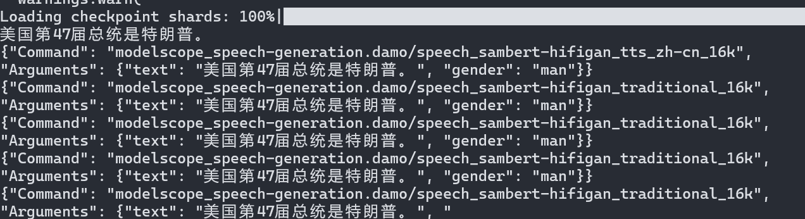

# 2.4 InternLM + LlamaIndex RAG 实践

## 1. InternLM API + LlamaIndex RAG
通过RAG的技术，可以实现
1. 增强大模型的知识能力，即使是在大模型的训练语料库里面没有的知识，比如更近期的信息。
2. 增强大模型私有和垂直领域的知识，这些通常也不会出现在语料库里面。

### 无RAG测试
`Python 3.13`于2024年10月7日发布[Python 3.13 有什么新变化](https://docs.python.org/zh-cn/dev/whatsnew/3.13.html#dbm)，目测InternLM应该不知道新增的功能和特性。

网页中有如下内容，介绍了新的 `dbm.sqlite3` 模块现在是默认的 `dbm` 后端。
```html
<p>标准库中的重大改进：</p>
<ul class="simple">
...
<li><p>新的 <a class="reference internal" href="../library/dbm.html#module-dbm.sqlite3" title="dbm.sqlite3: SQLite backend for dbm (All)"><code class="xref py py-mod docutils literal notranslate"><span class="pre">dbm.sqlite3</span></code></a> 模块现在是默认的 <a class="reference internal" href="../library/dbm.html#module-dbm" title="dbm: Interfaces to various Unix &quot;database&quot; formats."><code class="xref py py-mod docutils literal notranslate"><span class="pre">dbm</span></code></a> 后端。</p></li>
...
</ul>
```

> 问题：Python 3.13默认的dbm后端是什么模块？

直接对InternLM提问，丝毫不会提交 `dbm.sqlite3` 模块，尝试了4, 5次基本都是这个样子。


[python代码在这里](./llamaindex-demo/test_internlm.py)

### LlamaIndex + RAG测试

下载网页html文件：
```bash
 curl https://docs.python.org/zh-cn/dev/whatsnew/3.13.html > /root/llamaindex-demo/data/python313_new_features.html
```

有趣的是，如果采用原始html格式的文本配合RAG技术使用，并不会得到正确答案。
初步猜想是由于原始html文件里面参杂了太多的tags，把一整句话打的稀碎，导致了在RAG pipline哪个位置出了偏差。



如果把html转换成markdown格式，无需任何额外处理，无论是文档还是python代码，就可以回答正确。


[python代码在这里](./llamaindex-demo/llamaindex_RAG.py)

> Lessions learned
> 1. 黑箱RAG不能全信
> 2. 数据清理很重要

> 思考：
在提高的Python代码示例中，没有RAG的代码用`OpenAI`客户端，但是采用RAG的代码中用了`OpenAILike`客户端。为什么？

## 2. Local InternLM + LlamaIndex RAG

使用本地模型和RAG技术步骤和前面基本相似，只是需要自己搭建环境，这里我们选择InternLM作为基础模型，LlamaIndex作为框架。
这里使用 `InternLM2 1.8B` 作为基础模型。

> 问题：和前面的API调用相比，在版本上有很大的区别，比如`llama-index`, `transformers`, `torch`等库的版本都不相同，为什么？
是为了适配 `InternLM2 1.8B` 模型吗？

### 无RAG测试

川普最近当选了美国总统，来看一下 `InternLM2 1.8B` 对这个问题是怎么回答的。

> 提问：美国第47届总统是谁？

在没有RAG的情况下，我们直接使用 `InternLM2 1.8B` 模型进行回答。

[python代码示例](./llamaindex-local/llamaindex_internlm.py)



意料之中

### LlamaIndex + RAG测试

找了个搜狐的新闻，下载html文件作为语料库。

[python代码示例](./llamaindex-local/llamaindex_rag.py)



可以看到，RAG技术确实能够帮助模型更好地理解上下文信息，从而给出更加准确的回答。

> 这个使用本地模型，无论有无RAG，答案总是给出很多次，这是为什么？

## 3. Streamlit 应用和部署
