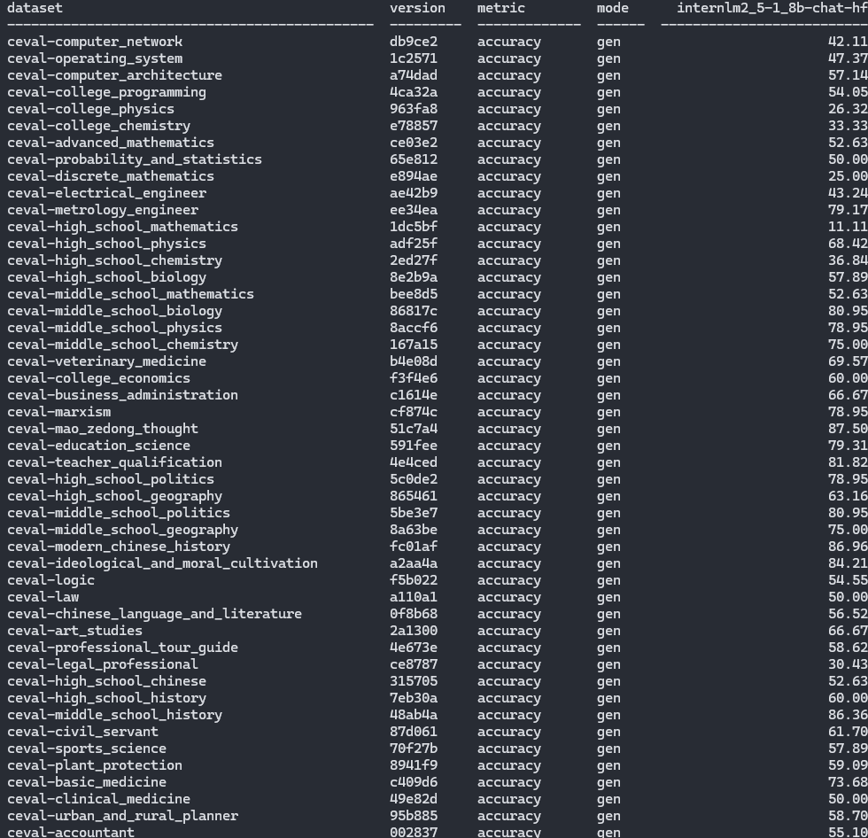

# 2.6 大模型评测

## 1. 评测API模型

### 1.1 配置环境
``` bash
conda create -n opencompass python=3.10
conda activate opencompass

cd /root
git clone -b 0.3.3 https://github.com/open-compass/opencompass
cd opencompass
pip install -e .
pip install -r requirements.txt
pip install huggingface_hub==0.25.2

pip install importlib-metadata
```

### 1.2 评测API模型

#### 1.2.1 配置API Key

``` bash
export INTERNLM_API_KEY=“xxx”
```

#### 1.2.2 配置模型

新建`python`文件：`/root/opencompass/opencompass/configs/models/openai/puyu_api.py`

[puyu_api.py](./opencompass/puyu_api.py)

#### 1.2.3 配置数据集

新建`python`文件：`/root/opencompass/opencompass/configs/datasets/demo/demo_cmmlu_chat_gen.py`

[demo_cmmlu_chat_gen.py](./opencompass/demo_cmmlu_chat_gen.py)

#### 1.2.4 评测
记得提前配置好`INTERNLM_API_KEY`。
运行：
``` bash
python run.py --models puyu_api.py --datasets demo_cmmlu_chat_gen.py --debug
```

> 评测结果 [结果文件](./opencompass/api_result.txt)
> 
> 


> 出现 rouge 导入报错的问题, 可以尝试重新安装 `rough` 包解决。
> ``` bash
> pip uninstall rouge 
> pip install rouge==1.0.1
> ```

## 2. 评测本地模型

### 2.1 配置环境

``` bash
conda install pytorch==2.3.1 torchvision==0.18.1 torchaudio==2.3.1 pytorch-cuda=12.1 -c pytorch -c nvidia -y
apt-get update
apt-get install cmake
pip install protobuf==4.25.3

pip uninstall numpy -y
pip install "numpy<2.0.0,>=1.23.4"
pip uninstall pandas -y
pip install "pandas<2.0.0"
pip install onnxscript
pip uninstall transformers -y
pip install transformers==4.39.0
```

复制数据集

``` bash
cp /share/temp/datasets/OpenCompassData-core-20231110.zip /root/opencompass/
unzip OpenCompassData-core-20231110.zip
```

### 2.2 配置模型

生成模型和数据集的相关配置

``` bash
python tools/list_configs.py internlm ceval
```
修改`configs/models/hf_internlm/的 hf_internlm2_5_1_8b_chat.py`文件：

``` python
from opencompass.models import HuggingFacewithChatTemplate

models = [
    dict(
        type=HuggingFacewithChatTemplate,
        abbr='internlm2_5-1_8b-chat-hf',
        path='/share/new_models/Shanghai_AI_Laboratory/internlm2_5-1_8b-chat/',
        max_out_len=2048,
        batch_size=8,
        run_cfg=dict(num_gpus=1),
    )
]
```

同样运行命令，等待结果

``` bash
python run.py --datasets ceval_gen --models hf_internlm2_5_1_8b_chat --debug
```

> 评测结果 [结果文件](./opencompass/local_result.txt)
> 
> 


## 3. 评测部署成API服务

### 3.1 配置环境

``` bash
pip install lmdeploy==0.6.1 openai==1.52.0
```

使用 `LMDeploy` 部署 `internlm2_5-1_8b-chat` 模型

``` bash
lmdeploy serve api_server /share/new_models/Shanghai_AI_Laboratory/internlm2_5-1_8b-chat/ --server-port 23333
```

部署成功会有如下显示：
> 

获取由 LMDeploy 注册的模型名称，创建一个新文件 `api-get-models.py`，内容如下：

``` python
from openai import OpenAI
client = OpenAI(
    api_key='sk-123456',
    base_url="http://0.0.0.0:23333/v1"
)
model_name = client.models.list().data[0].id
print(model_name) # 打印出model_name 
```

> 得到模型名称：`/share/new_models/Shanghai_AI_Laboratory/internlm2_5-1_8b-chat/`

> 如果发出以下错误：
> 
> ``` bash
> TypeError: Client.__init__() got an unexpected keyword argument 'proxies'
> ```
>
> 是由于新版本的`httpx`没有`proxies`参数，可以尝试降级级`httpx`版本（或者升级`OpenAI`版本）：
>
> ``` bash
> pip install -U httpx==0.27.2
> ```


### 3.2 评测

运行命令，等待结果：

``` bash
opencompass --models hf_internlm2_5_1_8b_chat_api --datasets ceval_gen --debug
```

> 评测结果 [结果文件](./opencompass/deploy_result.txt)
> 
> 

完结撒花 `:)` 